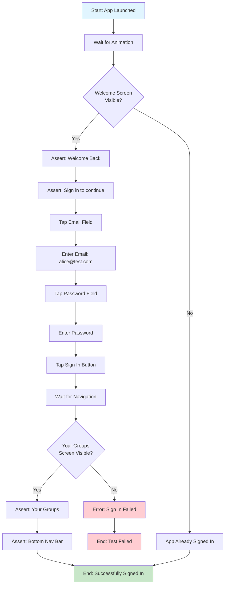

# Sign In Flow Chart

```mermaid
flowchart TD
    A[Start: App Launched] --> B[Wait for Animation]
    B --> C{Welcome Screen<br/>Visible?}
    C -->|Yes| D[Assert: Welcome Back]
    C -->|No| E[App Already Signed In]
    D --> F[Assert: Sign in to continue]
    F --> G[Tap Email Field]
    G --> H[Enter Email: alice@test.com]
    H --> I[Tap Password Field]
    I --> J[Enter Password]
    J --> K[Tap Sign In Button]
    K --> L[Wait for Navigation]
    L --> M{Your Groups<br/>Screen Visible?}
    M -->|Yes| N[Assert: Your Groups]
    M -->|No| O[Error: Sign In Failed]
    N --> P[Assert: Bottom Nav Bar]
    P --> Q[End: Successfully Signed In]
    E --> Q
    O --> R[End: Test Failed]
    
    style A fill:#e1f5ff
    style Q fill:#c8e6c9
    style R fill:#ffcdd2
    style O fill:#ffcdd2
```

